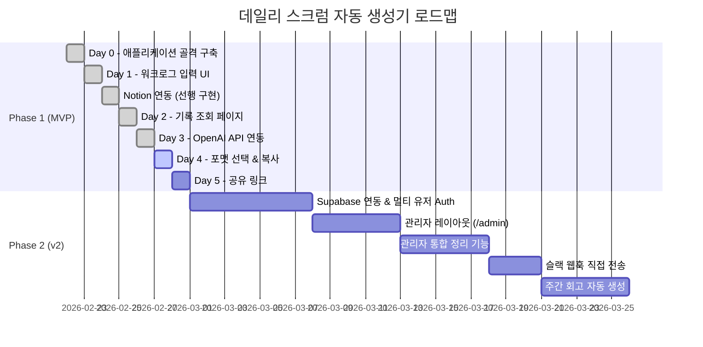
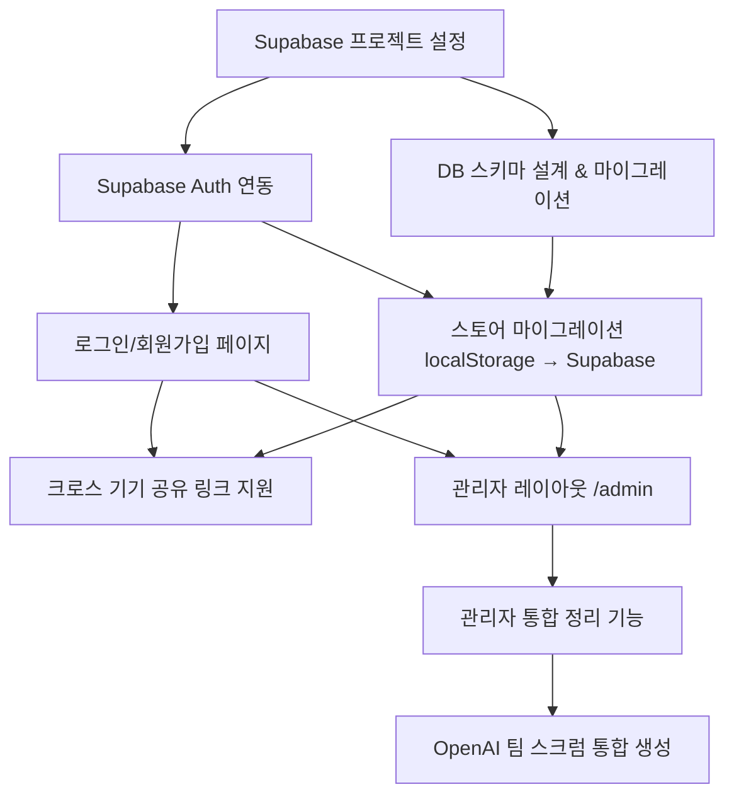

# 프로젝트 로드맵

> 마지막 업데이트: 2026-02-24
> 버전: 2.0
> 기반 PRD: docs/PRD.md

---

## 프로젝트 개요

매일 반복되는 데일리 스크럼 작성 비용을 줄이기 위해, 개발자가 작업 내용을 빠르게 기록하면 OpenAI가 자동으로 스크럼 문서를 생성해주는 개인용 워크로그 도구입니다. 슬랙/마크다운 호환 포맷으로 원클릭 공유까지 지원하여, 스크럼 준비에 소요되는 시간을 하루 5분 이내로 단축하는 것을 목표로 합니다. Phase 2에서는 멀티 유저 지원과 관리자 뷰를 통해 팀 전체의 데일리 스크럼을 한곳에서 관리할 수 있도록 확장합니다.

---

## 성공 지표 (KPIs)

- [ ] 작업 항목 입력부터 저장까지 1분 이내 완료 가능
- [ ] "스크럼 생성" 버튼 1회 클릭으로 공유 가능한 문서 완성
- [ ] 슬랙/마크다운 포맷 전환 및 클립보드 복사가 3초 이내 완료
- [ ] 공유 링크로 접근 시 로그인 없이 스크럼 내용 열람 가능
- [ ] 모바일(375px~)에서도 워크로그 입력 전 기능 사용 가능
- [ ] (Phase 2) 관리자가 팀원 전체의 스크럼을 단일 페이지에서 조회 가능

---

## 타겟 사용자

| 페르소나 | 설명 | 핵심 니즈 |
|---------|------|----------|
| 개발자 (작성자) | 팀에서 데일리 스크럼을 공유하는 개발자 1인 | 빠른 작업 기록 + 자동 정리 |
| 팀원 (열람자) | 공유 링크로 스크럼을 확인하는 팀원 | 로그인 없이 스크럼 내용 열람 |
| 관리자 (Phase 2) | 팀 전체 스크럼을 확인하고 정리하는 팀 리드 | 멤버별 스크럼 통합 조회 및 일괄 정리 |

---

## 개발 단계 개요



---

## Phase 1: MVP - 워크로그 & AI 스크럼 자동 생성

**기간:** Day 0 ~ Day 5 (Day 0~3, Notion 연동은 완료)
**목표:** localStorage 기반으로 워크로그 CRUD, AI 스크럼 생성, 포맷 선택, 공유 기능까지 동작하는 MVP 완성

### 기술 아키텍처

- **저장소:** localStorage (Zustand persist 미들웨어로 자동 직렬화)
- **상태 관리:** `useWorklogStore` (워크로그), `useScrumStore` (스크럼) 두 스토어로 도메인 분리 — 완료
- **AI 연동:** Next.js Route Handler(`/api/generate-scrum`)에서 OpenAI API 호출, 클라이언트에 API 키 노출 방지 — 완료
- **공유:** localStorage에 저장된 스크럼을 `shareId`로 조회 — 같은 브라우저 내에서만 유효 [가정: MVP는 단일 기기 사용]
- **컴포넌트 전략:** Server Component를 기본으로, 사용자 인터랙션이 필요한 영역만 `"use client"` Client Component로 분리

---

### Day 0: 애플리케이션 골격 구축 (완료)

**목표:** 개발에 필요한 프로젝트 기반 구조를 모두 갖춘다.

#### 구현 항목

- [x] Next.js 16.1.6 (App Router) + TypeScript 5 프로젝트 생성
- [x] Tailwind CSS v4 + shadcn/ui 설치 및 설정
- [x] next-themes, Sonner, Lucide React, usehooks-ts 설치
- [x] `src/app/layout.tsx` — RootLayout (ThemeProvider, SiteHeader, SiteFooter 포함)
- [x] `components/layout/` — Container, SiteHeader, SiteFooter, MainNav, MobileNav
- [x] `components/ui/` — EmptyState, Spinner, ConfirmDialog, StatCard, PasswordInput, SearchInput
- [x] `hooks/use-confirm.tsx` — Promise 기반 확인 다이얼로그 훅
- [x] `types/index.ts` — WorkTag, WorkStatus, WorkItem, WorkLog, ScrumFormat, DailyScrum 완료
- [x] `stores/use-worklog-store.ts` — localStorage persist 완료
- [x] `stores/use-scrum-store.ts` — localStorage persist 완료
- [x] `lib/validations/worklog.ts` — workItemSchema, scrumEditSchema 완료 (Zod v4: `import { z } from "zod/v4"`)
- [x] `config/site.ts` — siteConfig, mainNav 3개 메뉴 완료
- [x] 모든 페이지 라우트 플레이스홀더 (`/`, `/scrum`, `/history`, `/share/[id]`, `/not-found`)

#### 완료 기준

- [x] `pnpm dev` 실행 시 모든 페이지가 에러 없이 로드됨
- [x] 다크모드 토글 동작
- [x] `pnpm build` 통과

---

### Day 1: 워크로그 입력 UI + localStorage 저장 (완료)

**목표:** 오늘의 워크로그 페이지(`/`)에서 작업 항목을 추가 / 수정 / 삭제할 수 있고, localStorage에 자동 저장된다.

#### 구현 항목

- [x] `components/worklog/work-item-form.tsx` — React Hook Form + workItemSchema 기반 폼
- [x] `components/worklog/work-item-card.tsx` — 인라인 편집 + useConfirm 삭제 확인
- [x] `components/worklog/work-item-badge.tsx` — 태그/상태 Badge 색상 매핑
- [x] `components/worklog/worklog-list.tsx` — WorkItemCard 목록 + EmptyState 재사용
- [x] `components/worklog/date-selector.tsx` — 날짜 선택기 (기본값: 오늘)
- [x] `src/app/page.tsx` 업데이트 — WorklogList Client Component 삽입

#### 완료 기준

- [x] 작업 항목 추가 / 수정 / 삭제 → 즉시 목록 반영
- [x] 페이지 새로고침 후에도 localStorage에서 데이터 복원
- [x] 태그/상태 Badge가 색상으로 구분되어 표시
- [x] 모바일(375px) + 다크모드 정상 표시
- [x] `pnpm build` 통과

---

### Notion 연동 (선행 구현) — 2026-02-22 (완료)

> PRD v1에서는 "제외 범위(v2 이후)"로 분류되었으나, 사용자 요청에 따라 MVP 단계에서 선행 구현되었습니다.

#### 구현 항목

- [x] `lib/notion.ts` — Notion 클라이언트 싱글톤 + `extractPageId` 유틸 (`@notionhq/client 5.9.0`)
- [x] `src/app/api/notion/upload/route.ts` — `POST /api/notion/upload` Route Handler
- [x] `src/app/api/notion/page/route.ts` — `GET /api/notion/page` Route Handler
- [x] `components/worklog/notion-sync.tsx` — 업로드 / 가져오기 UI 컴포넌트
- [x] `components/worklog/worklog-list.tsx` 수정 — NotionSync 통합 완료

#### 완료 기준

- [x] "Notion에 업로드" 클릭 시 Notion에 새 페이지 생성, toast.success() 노출
- [x] 작업 항목 없을 때 업로드 버튼 disabled 처리
- [x] "Notion 가져오기" Dialog에서 URL/ID 입력 → 내용 텍스트 표시 + 복사 버튼
- [x] `pnpm build` 통과

---

### Day 2: 날짜별 기록 조회 페이지 (완료)

**목표:** `/history` 페이지에서 날짜별 워크로그 목록을 확인하고, 특정 날짜의 상세 내역을 열람할 수 있다.

#### 구현 항목

- [x] `components/history/history-list.tsx` — 날짜 내림차순 정렬, EmptyState 재사용
- [x] `components/history/history-day-card.tsx` — Accordion 패턴 접기/펼치기, 스크럼 생성 뱃지
- [x] `src/app/history/page.tsx` 업데이트 — HistoryList Client Component 삽입

#### 완료 기준

- [x] 날짜별 워크로그가 최신순으로 정렬되어 표시
- [x] 날짜 카드 펼치기/접기 동작 정상
- [x] 기록 없을 때 EmptyState + 홈 이동 버튼 표시
- [x] 모바일 + 다크모드 정상 표시
- [x] `pnpm build` 통과

---

### Day 3: OpenAI API 연동 + 스크럼 자동 생성 (완료)

**목표:** `/scrum` 페이지에서 "스크럼 자동 생성" 버튼 클릭 시 OpenAI API가 어제 한 일 / 오늘 할 일 초안을 자동 생성한다.

#### 구현 항목

- [x] `src/app/api/generate-scrum/route.ts` — OpenAI `gpt-4o-mini` API Route Handler (`response_format: json_object`)
- [x] `lib/validations/scrum.ts` — generateScrumRequestSchema, generateScrumResponseSchema
- [x] `components/scrum/scrum-generator.tsx` — 생성 트리거 UI + Spinner + toast 에러 처리
- [x] `components/scrum/scrum-preview.tsx` — 생성 결과 인라인 편집 가능 미리보기
- [x] `src/app/scrum/page.tsx` 업데이트 — ScrumGenerator 삽입

#### 완료 기준

- [x] "스크럼 자동 생성" 버튼 클릭 시 로딩 스피너 표시
- [x] OpenAI API 응답으로 어제 한 일 / 오늘 할 일 목록 자동 채워짐
- [x] 생성된 내용 인라인 수정 가능
- [x] API 오류 시 `toast.error()` 에러 메시지 표시
- [x] `OPENAI_API_KEY` 누락 시 명확한 서버 에러 반환
- [x] Playwright MCP E2E 테스트 통과
- [x] `pnpm build` 통과

---

### Day 4: 포맷 선택 + 클립보드 복사 (미구현)

**목표:** 슬랙 포맷 / 마크다운 포맷을 선택하고, 해당 포맷으로 렌더링된 스크럼을 원클릭으로 클립보드에 복사할 수 있다.

#### 구현 항목

**기능 1: 포맷 렌더러 유틸 함수**

- [ ] `lib/scrum-formatter.ts` 생성
  - 구현 방법: `DailyScrum` 타입을 받아 포맷별 문자열 반환
  - `formatAsSlack(scrum: DailyScrum): string` — 이모지 + 블릿 형식 변환
  - `formatAsMarkdown(scrum: DailyScrum): string` — 마크다운 헤더/목록 변환
  - 관련 파일: `types/index.ts` (DailyScrum 타입)

```
// 슬랙 포맷 예시
// 📅 데일리 스크럼 - 2월 24일 (화)
// ✅ 어제 한 일
// • 항목1
// 🔨 오늘 할 일
// • 항목2
// ⚠️ 블로커
// • 없음

// 마크다운 포맷 예시
// ## 데일리 스크럼 - 2026-02-24
// ### 어제 한 일
// - 항목1
```

**기능 2: FormatSelector - 포맷 선택 탭**

- [ ] `components/scrum/format-selector.tsx` 생성 (Client Component)
  - 구현 방법: shadcn/ui `Tabs` 사용
  - 탭 1: "슬랙" → `ScrumFormat = "slack"` 선택
  - 탭 2: "마크다운" → `ScrumFormat = "markdown"` 선택
  - 탭 변경 시 `useScrumStore.updateScrumField(date, "format", value)` 호출
  - 관련 파일: `components/ui/tabs.tsx`, `stores/use-scrum-store.ts`

**기능 3: CopyButton - 클립보드 복사 버튼**

- [ ] `components/scrum/copy-button.tsx` 생성 (Client Component)
  - 구현 방법: `useCopyToClipboard` (`usehooks-ts` 제공) 활용
  - 복사 성공 시 버튼 아이콘이 `Copy` → `Check`로 2초간 변경
  - 복사 성공 시 `toast.success("클립보드에 복사되었습니다")` 알림
  - 관련 파일: `components/ui/button.tsx`

**기능 4: ScrumOutput - 최종 출력 미리보기 영역**

- [ ] `components/scrum/scrum-output.tsx` 생성 (Client Component)
  - 구현 방법: `FormatSelector` + 포맷 렌더링 결과 `<pre>` 태그 표시 + `CopyButton` 조합
  - 선택된 포맷에 따라 `formatAsSlack()` 또는 `formatAsMarkdown()` 결과 렌더링
  - 스크럼이 없을 때: `EmptyState` 재사용 (icon=FileText)
  - 관련 파일: `lib/scrum-formatter.ts`, `components/scrum/format-selector.tsx`, `components/scrum/copy-button.tsx`

#### 테스트 (Playwright MCP — 필수)

- [ ] `/scrum` 페이지에서 포맷 탭 전환 및 클립보드 복사 흐름 검증
  - 테스트 도구: `browser_navigate` → `browser_snapshot` → `browser_click` (슬랙 탭) → `browser_snapshot` → `browser_click` (마크다운 탭) → `browser_snapshot` → `browser_click` (복사 버튼) → `browser_snapshot`
  - 성공 조건: 탭 전환 시 미리보기 내용이 포맷에 맞게 변경되고, 복사 버튼 클릭 후 `toast.success()` 노출
  - 실패 시: 구현 수정 후 테스트 재수행 (통과 전까지 완료 처리 금지)

#### 완료 기준 (Definition of Done)

- [ ] 슬랙/마크다운 탭 전환 시 미리보기 즉시 변경
- [ ] "복사" 버튼 클릭 후 `toast.success()` 알림 표시
- [ ] Playwright MCP E2E 테스트 통과 (포맷 전환 + 복사 흐름)
- [ ] 모바일(375px) + 다크모드 정상 표시
- [ ] `pnpm build` 통과

---

### Day 5: 공유 링크 기능 (/share/[id]) (미구현)

**목표:** 스크럼 생성 후 "공유 링크 복사" 버튼으로 `/share/[shareId]` 링크를 생성하고, 해당 링크에서 로그인 없이 스크럼 내용을 읽기 전용으로 열람할 수 있다.

#### 구현 항목

**기능 1: ShareButton - 공유 링크 생성 및 복사**

- [ ] `components/scrum/share-button.tsx` 생성 (Client Component)
  - 구현 방법: `useScrumStore.getScrum(date).shareId`를 조회하여 절대 URL 구성
  - URL 형식: `${window.location.origin}/share/${shareId}`
  - `useCopyToClipboard`로 링크 복사 후 `toast.success("공유 링크가 복사되었습니다")` 알림
  - 스크럼이 없을 때: 버튼 `disabled` 처리
  - 관련 파일: `stores/use-scrum-store.ts`

**기능 2: SharedScrumView - 공유 페이지 읽기 전용 뷰**

- [ ] `components/share/shared-scrum-view.tsx` 생성 (Client Component)
  - 구현 방법: `useScrumStore.getScrumByShareId(shareId)`로 스크럼 조회
  - 조회 성공: 스크럼 날짜, 어제 한 일, 오늘 할 일, 블로커를 읽기 전용 카드로 표시
  - 조회 실패 (없는 shareId): `EmptyState` (icon=Share2) + 홈 이동 버튼 재사용
  - 포맷 선택 불가 (읽기 전용), 클립보드 복사 버튼만 제공
  - 관련 파일: `stores/use-scrum-store.ts`, `components/ui/empty-state.tsx`

**기능 3: 공유 페이지 조립**

- [ ] `src/app/share/[id]/page.tsx` 업데이트
  - 기존 EmptyState 플레이스홀더를 `SharedScrumView` Client Component로 교체
  - Server Component 유지 (params await 처리 이미 완료: `const { id } = await params`)

**기능 4: 스크럼 페이지에 공유 버튼 통합**

- [ ] `components/scrum/scrum-output.tsx`에 `ShareButton` 추가
  - 스크럼이 생성된 후에만 공유 버튼 활성화

#### 테스트 (Playwright MCP — 필수)

- [ ] 공유 링크 생성 → 접근 → 읽기 전용 확인 흐름 검증
  - 테스트 도구: `browser_navigate` → `http://localhost:3000/scrum` → `browser_click` (공유 링크 복사) → `browser_snapshot` (toast 확인) → `browser_navigate` (`/share/[id]`) → `browser_snapshot` (읽기 전용 확인)
  - 성공 조건: 스크럼 내용이 읽기 전용으로 정상 표시되고, 편집 UI가 없음
  - 실패 시: 구현 수정 후 테스트 재수행 (통과 전까지 완료 처리 금지)
- [ ] 존재하지 않는 shareId 접근 시 EmptyState 표시 확인
  - `browser_navigate` → `/share/invalid-id` → `browser_snapshot`

#### 완료 기준 (Definition of Done)

- [ ] "공유 링크 복사" 버튼 클릭 시 `/share/[shareId]` URL이 클립보드에 복사
- [ ] 공유 링크 접근 시 스크럼 내용 정상 표시 (같은 브라우저/기기)
- [ ] 없는 shareId 접근 시 EmptyState 표시
- [ ] 공유 페이지에서 편집 불가 (읽기 전용) 확인
- [ ] Playwright MCP E2E 테스트 통과 (공유 링크 생성 → 접근 → 읽기 전용 흐름)
- [ ] 모바일(375px) + 다크모드 정상 표시
- [ ] `pnpm build` 통과

#### 기술적 리스크

| 리스크 | 영향도 | 대응 방안 |
|--------|--------|----------|
| localStorage 기반이므로 다른 기기/브라우저에서 공유 링크 열람 불가 | 높음 | MVP 제약사항으로 문서화, Phase 2에서 Supabase 연동으로 해결 |
| 브라우저 localStorage 초기화 시 모든 데이터 손실 | 중간 | 데이터 내보내기 기능 Phase 2 이후 검토 |

---

### Phase 1 전체 완료 기준

- [ ] Day 4~5 미구현 기능 완료
- [ ] `pnpm lint` 에러 없음
- [ ] `pnpm build` 성공
- [ ] TypeScript strict 모드, `any` 타입 없음
- [ ] 모든 페이지 모바일(375px) 반응형 레이아웃 정상
- [ ] 모든 페이지 다크모드 정상 표시
- [ ] Day 4, 5 Playwright MCP E2E 테스트 전체 통과

---

## Phase 2: 확장 기능 (v2)

**목표:** MVP 검증 후 Supabase 기반 멀티 유저 지원, 관리자 뷰 추가, 외부 서비스 연동 강화

> **선행 조건:** 멀티 유저 기능(Supabase Auth)이 완료되어야 관리자 기능 구현이 가능합니다. Supabase는 크로스 기기 공유 링크와 멀티 유저 모두에 공통으로 필요합니다.

### 기술 아키텍처 (Phase 2)

- **인증:** Supabase Auth (이메일/비밀번호 또는 OAuth)
- **데이터베이스:** Supabase PostgreSQL
  - `work_logs` 테이블: 날짜별 워크로그 (userId FK)
  - `work_items` 테이블: 작업 항목 (workLogId FK)
  - `daily_scrums` 테이블: 생성된 스크럼 (userId FK, shareId unique)
  - `teams` 테이블: 팀 단위 관리 (관리자 기능)
  - `team_members` 테이블: 팀원 멤버십
- **스토어 마이그레이션:** localStorage persist → Supabase 실시간 구독으로 전환
- **관리자 권한:** `teams.adminUserId`로 관리자 식별, Row Level Security(RLS) 정책 적용
- **API 전략:** Next.js Route Handler + Supabase 클라이언트 서버사이드 사용 (API 키 보호)

### 기술적 의존성 (Phase 2)



---

### Phase 2-1: Supabase 연동 & 멀티 유저 Auth

**기간:** 약 7일
**목표:** localStorage를 Supabase로 대체하여 크로스 기기 동기화와 멀티 유저 지원 기반을 마련한다.

#### 구현 항목

**기능 1: Supabase 프로젝트 초기화**

- [ ] Supabase 프로젝트 생성 및 환경변수 등록
  - 환경변수: `NEXT_PUBLIC_SUPABASE_URL`, `NEXT_PUBLIC_SUPABASE_ANON_KEY`, `SUPABASE_SERVICE_ROLE_KEY`
  - 관련 파일: `.env.local`, `.env.local.example`
- [ ] `@supabase/supabase-js`, `@supabase/ssr` 패키지 설치

**기능 2: DB 스키마 설계 & 마이그레이션**

- [ ] `supabase/migrations/` 디렉토리 생성, SQL 마이그레이션 파일 작성
  - `work_logs`: `id`, `user_id` (FK auth.users), `date`, `created_at`, `updated_at`
  - `work_items`: `id`, `work_log_id` (FK), `content`, `tag`, `status`, `order`
  - `daily_scrums`: `id`, `user_id` (FK), `date`, `yesterday` (jsonb), `today` (jsonb), `blocker`, `format`, `share_id` (unique), `created_at`
  - `teams`: `id`, `name`, `admin_user_id` (FK auth.users)
  - `team_members`: `team_id` (FK), `user_id` (FK), `role` (`admin` | `member`)
- [ ] Row Level Security (RLS) 정책 설정
  - 사용자 본인 데이터만 읽기/쓰기 허용
  - `team_members`를 통해 관리자가 팀원 데이터 조회 가능
  - `daily_scrums.share_id`로 공유 페이지 비인증 조회 허용

**기능 3: Supabase 클라이언트 유틸**

- [ ] `lib/supabase/client.ts` — 브라우저용 클라이언트 싱글톤
- [ ] `lib/supabase/server.ts` — 서버 컴포넌트/Route Handler용 클라이언트
- [ ] `lib/supabase/middleware.ts` — 세션 갱신 미들웨어 설정
- [ ] `middleware.ts` (프로젝트 루트) — 인증 미들웨어 적용 (`/admin` 경로 보호)

**기능 4: 인증 페이지 및 컴포넌트**

- [ ] `src/app/login/page.tsx` 신규 생성 (Server Component, metadata 포함)
- [ ] `src/app/signup/page.tsx` 신규 생성 (선택)
- [ ] `components/auth/login-form.tsx` (Client Component)
  - 구현 방법: React Hook Form + `loginSchema` (`lib/validations/auth.ts`) + Supabase Auth
  - 필드: email, password
  - 성공 시: 홈(`/`)으로 리다이렉트
  - 실패 시: `toast.error()` 알림
- [ ] `lib/validations/auth.ts` — loginSchema, signupSchema (Zod v4)
- [ ] `config/site.ts` 업데이트 — 로그인/로그아웃 메뉴 추가

**기능 5: 스토어 마이그레이션**

- [ ] `stores/use-worklog-store.ts` — localStorage persist 제거, Supabase 실시간 CRUD로 교체
  - `addWorkItem`, `updateWorkItem`, `deleteWorkItem` → Supabase INSERT/UPDATE/DELETE
  - `ensureWorkLog` → Supabase upsert
- [ ] `stores/use-scrum-store.ts` — localStorage persist 제거, Supabase CRUD로 교체
  - `saveScrum`, `updateScrumField`, `deleteScrum` → Supabase 연동
  - `getScrumByShareId` → Supabase 조회 (비인증 접근 허용)

#### 테스트 (Playwright MCP — 필수)

- [ ] 회원가입 → 로그인 → 워크로그 입력 → 재로그인 후 데이터 유지 흐름 검증
  - 테스트 도구: `browser_navigate` → `/login` → `browser_fill_form` → `browser_click` (로그인) → `browser_navigate` (`/`) → `browser_snapshot` (데이터 유지 확인)
  - 성공 조건: 로그인 후 이전 워크로그가 Supabase에서 정상 로드됨
  - 실패 시: 구현 수정 후 테스트 재수행

#### 완료 기준 (Definition of Done)

- [ ] 회원가입 / 로그인 / 로그아웃 정상 동작
- [ ] 워크로그, 스크럼 데이터가 Supabase에 저장되어 크로스 기기에서 접근 가능
- [ ] 공유 링크 (`/share/[id]`)가 다른 기기/브라우저에서 정상 표시
- [ ] 미인증 상태에서 `/admin` 접근 시 `/login`으로 리다이렉트
- [ ] Playwright MCP E2E 테스트 통과
- [ ] `pnpm build` 통과

#### 기술적 리스크

| 리스크 | 영향도 | 대응 방안 |
|--------|--------|----------|
| localStorage → Supabase 마이그레이션 시 기존 데이터 손실 | 높음 | 마이그레이션 유틸 함수 제공, 로컬 데이터 내보내기 기능 선행 구현 |
| Supabase RLS 정책 오류로 데이터 노출/접근 차단 | 높음 | 단위 테스트 + Playwright로 권한 시나리오 검증 |
| 실시간 구독 비용 및 연결 수 | 낮음 | MVP에서는 실시간 구독 대신 요청 시 조회 방식으로 시작 |

---

### Phase 2-2: 관리자 레이아웃 (/admin)

**기간:** 약 5일
**목표:** 관리자 권한을 가진 사용자가 `/admin` 페이지에서 팀 전체 멤버의 데일리 스크럼을 날짜별로 조회할 수 있다.

> **선행 조건:** Phase 2-1 (Supabase Auth + DB 스키마) 완료 필수

#### 구현 항목

**기능 1: 관리자 레이아웃 기반**

- [ ] `src/app/admin/layout.tsx` 신규 생성 (Server Component)
  - 구현 방법: Supabase 서버 클라이언트로 현재 사용자 세션 조회 → `team_members` 테이블에서 `role = 'admin'` 확인
  - 비관리자 접근 시: `notFound()` 또는 `/` 리다이렉트
  - 관련 파일: `lib/supabase/server.ts`, `middleware.ts`
- [ ] `src/app/admin/page.tsx` 신규 생성 (Server Component)
  - metadata: `{ title: "관리자 | 데일리 스크럼" }`

**기능 2: AdminMemberList - 팀원 목록**

- [ ] `components/admin/admin-member-list.tsx` 신규 생성 (Client Component)
  - 구현 방법: Supabase `team_members` + `auth.users` JOIN으로 팀원 목록 조회
  - 팀원 목록 카드 표시 (이름 / 이메일 / 당일 스크럼 작성 여부 뱃지)
  - 팀원 클릭 시 해당 팀원의 스크럼 목록으로 포커스 이동
  - 작성 완료: 초록 뱃지, 미작성: 회색 뱃지

**기능 3: AdminScrumTimeline - 날짜별 팀 스크럼 타임라인**

- [ ] `components/admin/admin-scrum-timeline.tsx` 신규 생성 (Client Component)
  - 구현 방법: 날짜 선택기(DateSelector 재사용) + 해당 날짜 전체 팀원 스크럼 조회
  - 날짜별 팀원 스크럼을 카드 그리드로 렌더링 (이름 + 어제 한 일 + 오늘 할 일 + 블로커)
  - 스크럼 미작성 팀원은 EmptyState 카드로 표시
  - 관련 파일: `components/worklog/date-selector.tsx` (재사용), `components/ui/card.tsx`

**기능 4: AdminScrumCard - 팀원별 스크럼 카드 (읽기 전용)**

- [ ] `components/admin/admin-scrum-card.tsx` 신규 생성
  - 구현 방법: shadcn/ui `Card` 기반
  - 표시 내용: 팀원 이름, 날짜, 어제 한 일, 오늘 할 일, 블로커 (읽기 전용)
  - 복사 버튼: 해당 팀원 스크럼 클립보드 복사 (`CopyButton` 재사용)

**기능 5: config 업데이트**

- [ ] `config/site.ts` 업데이트 — 관리자 메뉴 조건부 추가 (관리자 세션일 때만 표시)

#### 완료 기준 (Definition of Done)

- [ ] `/admin` 접근 시 관리자 권한 확인 후 팀원 목록 및 스크럼 타임라인 표시
- [ ] 날짜 선택기로 날짜 변경 시 해당 날짜 팀 전체 스크럼 즉시 갱신
- [ ] 팀원별 스크럼 복사 버튼 정상 동작
- [ ] 비관리자 접근 시 접근 차단
- [ ] 모바일(375px) + 다크모드 정상 표시
- [ ] `pnpm build` 통과

#### 기술적 리스크

| 리스크 | 영향도 | 대응 방안 |
|--------|--------|----------|
| 팀원 수 증가 시 API 응답 지연 | 중간 | 페이지네이션 또는 날짜 범위 제한 (최근 30일), Supabase 인덱스 최적화 |
| Supabase RLS가 관리자 조회를 차단 | 높음 | `team_members` 기반 RLS 정책 명시적 정의, 테스트로 검증 |

---

### Phase 2-3: 관리자 통합 정리 기능

**기간:** 약 5일
**목표:** 관리자가 팀원별 데일리 스크럼을 선택하여 하나의 통합 팀 스크럼 문서로 정리하고, 복사/공유할 수 있다.

> **선행 조건:** Phase 2-2 (관리자 레이아웃) 완료 필수

#### 구현 항목

**기능 1: 팀원 스크럼 선택 UI**

- [ ] `components/admin/admin-scrum-selector.tsx` 신규 생성 (Client Component)
  - 구현 방법: `AdminScrumTimeline`에 체크박스 추가, 선택된 팀원 스크럼 목록 관리
  - Zustand 스토어 또는 로컬 state로 선택 목록 관리
  - "전체 선택" / "전체 해제" 버튼 제공
  - 선택 후 "통합 정리" 버튼 활성화

**기능 2: 통합 스크럼 생성 API Route Handler**

- [ ] `src/app/api/admin/consolidate-scrum/route.ts` 신규 생성 (Server Component)
  - 구현 방법: 선택된 팀원들의 스크럼 데이터를 수집 → OpenAI `gpt-4o-mini`로 통합 요약 생성
  - 요청 바디: `{ scrums: DailyScrum[], date: string, format: ScrumFormat }`
  - 프롬프트: 팀원별 스크럼을 받아 "팀 전체 어제 한 일 / 팀 전체 오늘 할 일 / 공통 블로커" 구조로 요약
  - 응답: `{ teamYesterday: string[], teamToday: string[], teamBlocker: string }` JSON 반환
  - 인증: 관리자 세션 검증 필수
  - 환경변수: `OPENAI_API_KEY`

**기능 3: 통합 스크럼 미리보기 및 편집**

- [ ] `components/admin/admin-consolidated-preview.tsx` 신규 생성 (Client Component)
  - 구현 방법: `ScrumPreview` 컴포넌트 패턴 재사용 (인라인 편집 가능)
  - 구성: 팀 어제 한 일 / 팀 오늘 할 일 / 공통 블로커 편집 가능 목록
  - 포맷 선택: `FormatSelector` 재사용 (슬랙/마크다운)
  - 복사 버튼: `CopyButton` 재사용

**기능 4: 통합 스크럼 저장 및 공유**

- [ ] `daily_scrums` 테이블에 `is_team_scrum: boolean` 컬럼 추가 (마이그레이션)
- [ ] `src/app/api/admin/save-team-scrum/route.ts` 신규 생성
  - 통합 스크럼 Supabase 저장 + `shareId` 생성
  - 팀 공유 링크 생성 가능
- [ ] `src/app/admin/page.tsx` — 통합 정리 영역에 AdminScrumSelector + AdminConsolidatedPreview 통합

#### 테스트 (Playwright MCP — 필수)

- [ ] 팀원 스크럼 선택 → 통합 생성 → 복사 흐름 검증
  - 테스트 도구: `browser_navigate` → `/admin` → `browser_snapshot` → `browser_click` (팀원 체크박스) → `browser_click` (통합 정리) → `browser_wait_for` (결과) → `browser_snapshot` → `browser_click` (복사)
  - 성공 조건: 통합 스크럼이 팀원 스크럼을 포함하여 생성되고, 복사 버튼 후 toast.success() 노출
  - 실패 시: 구현 수정 후 테스트 재수행 (통과 전까지 완료 처리 금지)

#### 완료 기준 (Definition of Done)

- [ ] 팀원 스크럼 다중 선택 후 "통합 정리" 클릭 시 AI가 팀 스크럼 초안 생성
- [ ] 생성된 통합 스크럼 인라인 편집 가능
- [ ] 슬랙/마크다운 포맷 선택 및 클립보드 복사 가능
- [ ] 통합 스크럼 저장 및 공유 링크 생성 가능
- [ ] Playwright MCP E2E 테스트 통과
- [ ] 모바일(375px) + 다크모드 정상 표시
- [ ] `pnpm build` 통과

#### 기술적 리스크

| 리스크 | 영향도 | 대응 방안 |
|--------|--------|----------|
| 팀원 스크럼이 많을 때 OpenAI 토큰 초과 | 높음 | 팀원당 핵심 항목 최대 5개로 요약 후 전달, 경고 표시 |
| 관리자 API 인증 우회 | 높음 | Route Handler에서 Supabase 서버 클라이언트로 세션 검증 필수 |

---

### Phase 2-4: 기타 확장 기능

**목표:** 외부 서비스 연동 및 자동화 강화

#### 구현 항목

**슬랙 웹훅 직접 전송**

- [ ] `src/app/api/send-slack/route.ts` Route Handler 생성
  - 요청 바디: `{ text: string, webhookUrl: string }`
  - 사용자별 슬랙 Webhook URL 저장 (Supabase `user_settings` 테이블 또는 환경변수)
- [ ] `components/scrum/slack-send-button.tsx` UI 추가
  - 성공 시 `toast.success("슬랙에 전송되었습니다")` 알림

**주간 회고 자동 생성**

- [ ] `src/app/weekly/page.tsx` 신규 생성
- [ ] `src/app/api/generate-weekly/route.ts` Route Handler 생성
  - 주간 워크로그 집계 후 OpenAI `gpt-4o-mini`로 회고 요약 생성
- [ ] `components/weekly/weekly-generator.tsx`, `weekly-preview.tsx` 신규 생성

**노션 연동 고도화**

- [ ] Notion OAuth 연동 (현재 Integration Token 방식에서 업그레이드)
- [ ] 기존 Notion 페이지 업데이트 (upsert) 지원 (현재는 항상 새 페이지 생성)
  - `src/app/api/notion/upload/route.ts` 수정 — 날짜별 기존 페이지 조회 후 업데이트

---

## 디렉토리 구조 계획

```
프로젝트 루트/
├── src/app/
│   ├── page.tsx                       # [완료] WorklogList 삽입
│   ├── scrum/
│   │   └── page.tsx                   # [완료] ScrumGenerator 삽입
│   ├── history/
│   │   └── page.tsx                   # [완료] HistoryList 삽입
│   ├── share/
│   │   └── [id]/
│   │       └── page.tsx               # [Day 5 미구현] SharedScrumView 삽입 예정
│   ├── login/
│   │   └── page.tsx                   # [Phase 2-1 신규] 로그인 페이지
│   ├── admin/
│   │   ├── layout.tsx                 # [Phase 2-2 신규] 관리자 레이아웃 (권한 확인)
│   │   └── page.tsx                   # [Phase 2-2 신규] 팀 스크럼 타임라인 + 통합 정리
│   └── api/
│       ├── generate-scrum/
│       │   └── route.ts               # [완료] OpenAI API Route Handler
│       ├── notion/
│       │   ├── upload/route.ts        # [완료] Notion 업로드
│       │   └── page/route.ts          # [완료] Notion 페이지 조회
│       ├── send-slack/
│       │   └── route.ts               # [Phase 2-4 신규] 슬랙 웹훅 전송
│       └── admin/
│           ├── consolidate-scrum/
│           │   └── route.ts           # [Phase 2-3 신규] 팀 스크럼 통합 생성
│           └── save-team-scrum/
│               └── route.ts           # [Phase 2-3 신규] 통합 스크럼 저장
├── components/
│   ├── worklog/                       # [완료] work-item-form, work-item-card, worklog-list 등
│   ├── history/                       # [완료] history-list, history-day-card
│   ├── scrum/
│   │   ├── scrum-generator.tsx        # [완료]
│   │   ├── scrum-preview.tsx          # [완료]
│   │   ├── scrum-output.tsx           # [Day 4 미구현] FormatSelector + CopyButton + ShareButton 조합
│   │   ├── format-selector.tsx        # [Day 4 미구현]
│   │   ├── copy-button.tsx            # [Day 4 미구현]
│   │   └── share-button.tsx           # [Day 5 미구현]
│   ├── share/
│   │   └── shared-scrum-view.tsx      # [Day 5 미구현] 공유 페이지 읽기 전용 뷰
│   ├── auth/
│   │   └── login-form.tsx             # [Phase 2-1 신규]
│   └── admin/
│       ├── admin-member-list.tsx      # [Phase 2-2 신규]
│       ├── admin-scrum-timeline.tsx   # [Phase 2-2 신규]
│       ├── admin-scrum-card.tsx       # [Phase 2-2 신규]
│       ├── admin-scrum-selector.tsx   # [Phase 2-3 신규]
│       └── admin-consolidated-preview.tsx  # [Phase 2-3 신규]
├── lib/
│   ├── scrum-formatter.ts             # [Day 4 미구현] 슬랙/마크다운 포맷 변환 유틸
│   ├── notion.ts                      # [완료]
│   ├── validations/
│   │   ├── worklog.ts                 # [완료]
│   │   ├── scrum.ts                   # [완료]
│   │   └── auth.ts                    # [Phase 2-1 신규] loginSchema, signupSchema
│   └── supabase/                      # [Phase 2-1 신규]
│       ├── client.ts
│       └── server.ts
├── stores/
│   ├── use-worklog-store.ts           # [완료 → Phase 2-1에서 Supabase로 마이그레이션]
│   └── use-scrum-store.ts            # [완료 → Phase 2-1에서 Supabase로 마이그레이션]
├── supabase/
│   └── migrations/                    # [Phase 2-1 신규] SQL 마이그레이션 파일
└── middleware.ts                      # [Phase 2-1 신규] 인증 미들웨어
```

---

## 기술적 의존성

### Phase 1

```mermaid
graph TD
  A[types/index.ts] --> B[stores/use-worklog-store.ts]
  A --> C[stores/use-scrum-store.ts]
  A --> D[lib/validations/worklog.ts]
  A --> E[lib/validations/scrum.ts]
  B --> F[WorklogList - 완료]
  B --> G[ScrumGenerator - 완료]
  C --> G
  C --> H[SharedScrumView - Day 5]
  D --> F
  E --> I[/api/generate-scrum - 완료]
  F --> J[HistoryList - 완료]
  G --> K[ScrumOutput - Day 4]
  I --> G
  K --> L[CopyButton - Day 4]
  K --> M[ShareButton - Day 5]
  M --> H
```

### Phase 2

```mermaid
graph TD
  S[Supabase 설정] --> A[Supabase Auth]
  S --> B[DB 스키마]
  A --> C[로그인/회원가입]
  B --> D[스토어 마이그레이션]
  C --> D
  D --> E[크로스 기기 공유 링크]
  A --> F[관리자 레이아웃 /admin]
  D --> F
  F --> G[AdminMemberList + AdminScrumTimeline]
  G --> H[AdminScrumSelector]
  H --> I[/api/admin/consolidate-scrum]
  I --> J[AdminConsolidatedPreview]
```

---

## 기술 스택 결정사항

| 카테고리 | 기술 | 결정 이유 |
|---------|------|----------|
| 프레임워크 | Next.js 16.1.6 (App Router) | Server Component + Route Handler로 AI API 키 서버사이드 보호 |
| AI 모델 | OpenAI API `gpt-4o-mini` | 빠른 응답 속도 + 저렴한 비용, `response_format: json_object`로 안정적인 JSON 파싱 |
| 테스트 도구 | Playwright MCP | API 연동 및 비즈니스 로직 E2E 테스트, 브라우저 자동화 |
| 저장소 (MVP) | localStorage + Zustand persist | 백엔드 없이 MVP 빠른 구현, Supabase 마이그레이션 용이 |
| 저장소 (Phase 2) | Supabase PostgreSQL | 크로스 기기 동기화 + 멀티 유저 + RLS 기반 권한 관리 |
| 인증 (Phase 2) | Supabase Auth | DB와 동일 플랫폼, RLS 정책 자동 연동 |
| 상태 관리 | Zustand 5 | 보일러플레이트 최소, persist 미들웨어로 localStorage 자동 연동 |
| 폼 검증 | React Hook Form 7 + Zod 4 | 선언적 스키마 기반 검증, TypeScript 타입 추론 자동화 |
| UI | shadcn/ui + Tailwind CSS v4 | 다크모드 자동 지원, 접근성 기본 내장 (Radix UI 기반) |
| Notion 연동 | @notionhq/client 5.9.0 | 선행 구현 완료, Integration Token 방식 |
| 클립보드 복사 | usehooks-ts `useCopyToClipboard` | 이미 설치된 패키지 재사용 |
| 알림 | Sonner 2 (`toast()`) | Toaster가 루트에 설정되어 즉시 사용 가능 |

---

## 환경변수

| 변수명 | 필수 여부 | 단계 | 설명 |
|--------|---------|------|------|
| `OPENAI_API_KEY` | 필수 | Phase 1 Day 3~ | OpenAI API 인증 키 (`sk-...`) |
| `NOTION_API_KEY` | Notion 연동 시 필수 | Phase 1 (완료) | Notion Integration Token (`secret_...`) |
| `NOTION_PARENT_PAGE_ID` | Notion 업로드 시 필수 | Phase 1 (완료) | 업로드 대상 Notion 페이지 ID 또는 URL |
| `NEXT_PUBLIC_SUPABASE_URL` | Phase 2부터 필수 | Phase 2-1~ | Supabase 프로젝트 URL |
| `NEXT_PUBLIC_SUPABASE_ANON_KEY` | Phase 2부터 필수 | Phase 2-1~ | Supabase anon 공개 키 |
| `SUPABASE_SERVICE_ROLE_KEY` | Phase 2부터 필수 | Phase 2-1~ | Supabase 서비스 롤 키 (서버사이드 전용) |

`.env.local` 파일에 설정:

```bash
# Phase 1
OPENAI_API_KEY=sk-...
NOTION_API_KEY=secret_...
NOTION_PARENT_PAGE_ID=<페이지-ID-또는-URL>

# Phase 2 (Supabase 연동 후 추가)
NEXT_PUBLIC_SUPABASE_URL=https://xxxx.supabase.co
NEXT_PUBLIC_SUPABASE_ANON_KEY=eyJ...
SUPABASE_SERVICE_ROLE_KEY=eyJ...
```

---

## 제외 범위 (Won't Have - v1)

- 슬랙 웹훅 직접 전송 (Phase 2-4에서 구현 예정, 클립보드 복사로 MVP 대체)
- ~~노션 자동 업데이트~~ → **선행 구현 완료** (2026-02-22, "Notion 연동 (선행 구현)" 참고)
  - Notion OAuth는 여전히 제외, Integration Token 방식으로 구현됨
  - 기존 페이지 업데이트(upsert) 기능은 Phase 2-4 검토
- 주간 회고 자동 생성 (Phase 2-4 검토)
- 멀티 유저 / 팀 기능 (Phase 2-1~3에서 구현 예정)
- 알림 / 리마인더 (Phase 2 이후 검토)
- 크로스 기기 공유 링크 (localStorage 한계, Phase 2-1에서 Supabase 연동으로 해결)
- 데이터 내보내기 / 백업 (Phase 2 이후 검토)

---

## 미결 사항

| 항목 | 가정 | 확인 필요 |
|------|------|---------|
| 공유 링크 유효 범위 (Phase 1) | 같은 브라우저/기기에서만 유효 (localStorage 한계) | Phase 1에서 이 제약을 수용할지 여부 |
| 워크로그 항목 최대 수 | 날짜당 20개 이하 | OpenAI API 토큰 한도 고려 실제 최대치 결정 필요 |
| 날짜 기준 "전날" 정의 | 오늘 날짜 기준 -1일 (주말 미고려) | 금요일 → 월요일 스크럼 시 목요일 기준인지 금요일 기준인지 |
| 관리자 범위 (Phase 2) | 팀 단위로 관리자 1인 | 멀티 팀, 멀티 관리자 지원 여부 |
| 팀 생성 방식 (Phase 2) | 별도 관리자 초대 플로우 | 팀 생성 / 초대 UI 별도 구현 필요 여부 |
| 통합 스크럼 저장 위치 (Phase 2) | Supabase `daily_scrums` 테이블에 `is_team_scrum` 컬럼 추가 [가정] | 별도 `team_scrums` 테이블로 분리할지 여부 |

---

## 변경 이력

| 날짜 | 버전 | 변경 내용 | 작성자 |
|------|-----|----------|-------|
| 2026-02-22 | 1.0 | 초기 작성 (PRD v1.0 기반) | PM |
| 2026-02-22 | 1.1 | OpenAI API로 변경, Playwright MCP 테스트 섹션 추가 | PM |
| 2026-02-22 | 1.2 | Day 0 (애플리케이션 골격 구축) 섹션 추가, 기존 구현 상태 체크 반영 | PM |
| 2026-02-22 | 1.3 | Day 1 완료 체크 완료; Notion 연동 선행 구현 섹션 추가; Phase 2 노션 항목 완료 표시 | PM |
| 2026-02-24 | 2.0 | docs/roadmap.md로 재작성; Day 2, 3 완료 상태 반영; Phase 2에 멀티 유저 Auth, 관리자 레이아웃, 관리자 통합 정리 기능 구체화; Supabase DB 스키마 설계 추가; 기술적 의존성 Phase 2 Mermaid 다이어그램 추가; 환경변수 Phase 2 항목 추가 | PM |
