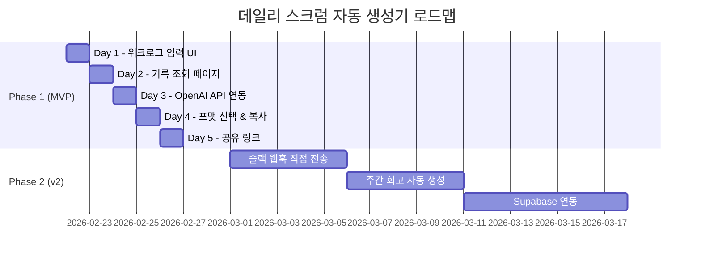
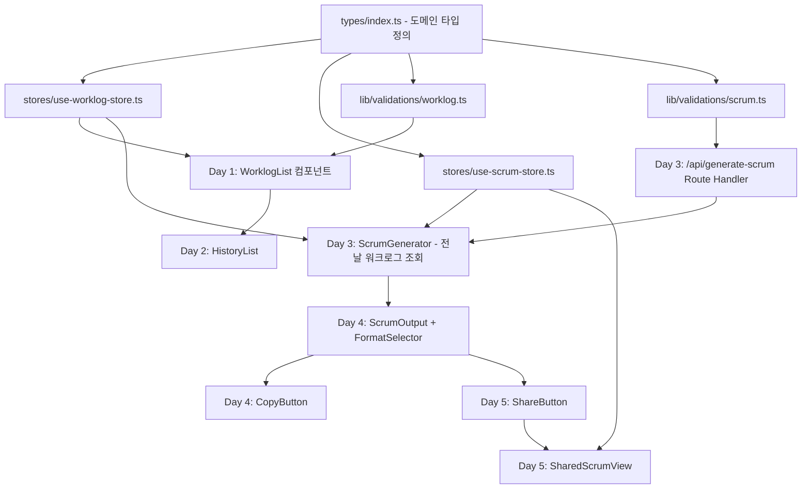

# 프로젝트 로드맵

> 마지막 업데이트: 2026-02-22
> 버전: 1.0
> 기반 PRD: docs/PRD.md

---

## 프로젝트 개요

매일 반복되는 데일리 스크럼 작성 비용을 줄이기 위해, 개발자가 작업 내용을 빠르게 기록하면 OpenAI가 자동으로 스크럼 문서를 생성해주는 개인용 워크로그 도구입니다. 슬랙/노션 호환 포맷으로 원클릭 공유까지 지원하여, 스크럼 준비에 소요되는 시간을 하루 5분 이내로 단축하는 것을 목표로 합니다.

---

## 성공 지표 (KPIs)

- [ ] 작업 항목 입력부터 저장까지 1분 이내 완료 가능
- [ ] "스크럼 생성" 버튼 1회 클릭으로 공유 가능한 문서 완성
- [ ] 슬랙/마크다운 포맷 전환 및 클립보드 복사가 3초 이내 완료
- [ ] 공유 링크로 접근 시 로그인 없이 스크럼 내용 열람 가능
- [ ] 모바일(375px~)에서도 워크로그 입력 전 기능 사용 가능

---

## 타겟 사용자

| 페르소나 | 설명 | 핵심 니즈 |
|---------|------|----------|
| 개발자 (작성자) | 팀에서 데일리 스크럼을 공유하는 개발자 1인 | 빠른 작업 기록 + 자동 정리 |
| 팀원 (열람자) | 공유 링크로 스크럼을 확인하는 팀원 | 로그인 없이 스크럼 내용 열람 |

---

## 개발 단계 개요



---

## Phase 1: MVP - 워크로그 & AI 스크럼 자동 생성

**기간:** 5일 (Day 1 ~ Day 5)
**목표:** localStorage 기반으로 워크로그 CRUD, AI 스크럼 생성, 공유 기능까지 동작하는 MVP 완성

### 기술 아키텍처

- **저장소:** localStorage (Zustand persist 미들웨어로 자동 직렬화)
- **상태 관리:** `useWorklogStore` (워크로그), `useScrumStore` (스크럼) 두 스토어로 도메인 분리 — 이미 구현 완료
- **AI 연동:** Next.js Route Handler(`/api/generate-scrum`)에서 OpenAI API 호출, 클라이언트에 API 키 노출 방지
- **공유:** localStorage에 저장된 스크럼을 `shareId`로 조회 — 같은 브라우저 내에서만 유효 [가정: MVP는 단일 기기 사용]
- **컴포넌트 전략:** Server Component를 기본으로, 사용자 인터랙션이 필요한 영역만 `"use client"` Client Component로 분리

---

### Day 1: 워크로그 입력 UI + localStorage 저장

**목표:** 오늘의 워크로그 페이지(`/`)에서 작업 항목을 추가 / 수정 / 삭제할 수 있고, localStorage에 자동 저장된다.

#### 구현 항목

**기능 1: WorkItemForm - 작업 추가 폼**

- [ ] `components/worklog/work-item-form.tsx` 생성 (Client Component)
  - 구현 방법: React Hook Form + `workItemSchema` (`lib/validations/worklog.ts`에 이미 정의됨) 사용
  - 필드: `content` (Textarea), `tag` (Select), `status` (Select)
  - 제출 시 `useWorklogStore.addWorkItem(today, content, tag, status)` 호출
  - 관련 파일: `components/ui/form.tsx`, `components/ui/textarea.tsx`, `components/ui/select.tsx`
- [ ] 태그 및 상태 Badge 색상 매핑 상수 정의
  - 구현 방법: `lib/utils.ts` 또는 `components/worklog/work-item-badge.tsx`에 `cn()` 기반 variant 정의
  - `WorkTag` → 색상: `feature`(파랑), `bugfix`(빨강), `meeting`(보라), `review`(노랑), `etc`(회색)
  - `WorkStatus` → 색상: `done`(초록), `in-progress`(파랑), `blocked`(빨강)

**기능 2: WorkItemCard - 작업 항목 카드**

- [ ] `components/worklog/work-item-card.tsx` 생성 (Client Component)
  - 구현 방법: shadcn/ui `Card` 기반, 인라인 편집(수정 모드 토글) 지원
  - 표시 내용: 작업 내용, 태그 Badge, 상태 Badge
  - 액션: 수정 버튼 → `updateWorkItem()`, 삭제 버튼 → `useConfirm` 훅으로 확인 후 `deleteWorkItem()` 호출
  - 관련 파일: `hooks/use-confirm.tsx`, `components/ui/confirm-dialog.tsx`

**기능 3: WorklogList - 작업 목록**

- [ ] `components/worklog/worklog-list.tsx` 생성 (Client Component)
  - 구현 방법: `useWorklogStore`에서 오늘 날짜 워크로그 구독, 항목이 없으면 `EmptyState` 표시
  - 항목 없을 때: `EmptyState` (icon=ClipboardList) 재사용
  - 항목 있을 때: `WorkItemCard` 목록 렌더링
  - 관련 파일: `components/ui/empty-state.tsx`

**기능 4: DateSelector - 날짜 선택기**

- [ ] `components/worklog/date-selector.tsx` 생성 (Client Component)
  - 구현 방법: shadcn/ui `Popover` + `Calendar` or 간단한 날짜 Input
  - 기본값: 오늘 날짜 (`new Date().toISOString().split("T")[0]`)
  - 날짜 변경 시 해당 날짜의 워크로그를 스토어에서 불러옴

**기능 5: 홈 페이지 조립**

- [ ] `src/app/page.tsx` 업데이트
  - 구현 방법: Server Component 유지, 내부에 `WorklogList` Client Component 삽입
  - "작업 추가" 버튼 → `WorkItemFormDialog` 다이얼로그 트리거로 교체

#### 완료 기준 (Definition of Done)

- [ ] 작업 항목 추가 → 목록에 즉시 반영
- [ ] 작업 항목 수정 → 변경 사항 즉시 반영
- [ ] 작업 항목 삭제 → `useConfirm` 확인 후 제거
- [ ] 페이지 새로고침 후에도 localStorage에서 데이터 복원
- [ ] 태그/상태 Badge가 색상으로 구분되어 표시
- [ ] 모바일(375px)에서 레이아웃 깨짐 없음
- [ ] 다크모드에서 정상 표시
- [ ] TypeScript `any` 타입 없음, `pnpm build` 통과

---

### Day 2: 날짜별 기록 조회 페이지

**목표:** `/history` 페이지에서 날짜별 워크로그 목록을 확인하고, 특정 날짜의 상세 내역을 열람할 수 있다.

#### 구현 항목

**기능 1: HistoryList - 날짜별 기록 목록**

- [ ] `components/history/history-list.tsx` 생성 (Client Component)
  - 구현 방법: `useWorklogStore.workLogs`를 날짜 내림차순 정렬하여 렌더링
  - 각 날짜 행: 날짜, 작업 항목 수, 태그 분포 Badge 요약 표시
  - 기록 없을 때: `EmptyState` (icon=History) 재사용
  - 관련 파일: `components/ui/empty-state.tsx`, `components/ui/card.tsx`

**기능 2: HistoryDayCard - 날짜별 카드**

- [ ] `components/history/history-day-card.tsx` 생성
  - 구현 방법: 날짜 헤더 + 해당 날짜 `WorkItem` 목록 요약 표시 (읽기 전용)
  - Accordion 패턴으로 접기/펼치기 지원 (`components/ui/accordion.tsx` 재사용)
  - 스크럼이 생성된 날짜는 "스크럼 생성됨" 뱃지 표시

**기능 3: 기록 조회 페이지 조립**

- [ ] `src/app/history/page.tsx` 업데이트
  - `HistoryList` Client Component 삽입

#### 완료 기준 (Definition of Done)

- [ ] 날짜별 워크로그가 최신순으로 정렬되어 표시
- [ ] 날짜 카드 펼치기/접기 동작 정상
- [ ] 기록 없을 때 `EmptyState` + 홈 이동 버튼 표시
- [ ] 모바일 및 다크모드 정상 표시
- [ ] `pnpm build` 통과

---

### Day 3: OpenAI API 연동 + 스크럼 자동 생성

**목표:** `/scrum` 페이지에서 "스크럼 자동 생성" 버튼 클릭 시, 전날 워크로그를 OpenAI API에 전송하여 어제 한 일 / 오늘 할 일 초안을 자동 생성한다.

#### 구현 항목

**기능 1: API Route Handler - 스크럼 생성 엔드포인트**

- [ ] `src/app/api/generate-scrum/route.ts` 생성 (Server-side)
  - 구현 방법: Next.js Route Handler로 OpenAI API (`gpt-4o-mini`) 호출
  - 요청 바디: `{ workItems: WorkItem[], format: ScrumFormat }`
  - 프롬프트 구성: 워크로그 항목을 마크다운 목록으로 변환 → OpenAI에 전송
  - 응답: `{ yesterday: string[], today: string[], blocker: string }` JSON 반환
  - 환경변수: `OPENAI_API_KEY` (`.env.local`에 설정)
  - 관련 파일: `types/index.ts` (WorkItem, ScrumFormat 타입 활용)

```typescript
// 프롬프트 구조 예시
// 시스템: "당신은 개발자의 워크로그를 데일리 스크럼 형식으로 요약하는 도우미입니다."
// 사용자: "다음 작업 항목을 바탕으로 어제 한 일, 오늘 할 일, 블로커를 JSON 형식으로 작성해주세요."
// response_format: { type: "json_object" } 사용으로 안정적인 JSON 파싱
```

**기능 2: Zod 스키마 - API 요청/응답 검증**

- [ ] `lib/validations/scrum.ts` 생성
  - `generateScrumRequestSchema`: 요청 바디 검증
  - `generateScrumResponseSchema`: Claude 응답 파싱/검증

**기능 3: ScrumGenerator - 스크럼 생성 UI**

- [ ] `components/scrum/scrum-generator.tsx` 생성 (Client Component)
  - 구현 방법:
    1. `useWorklogStore`에서 전날 날짜 워크로그 조회
    2. "스크럼 자동 생성" 버튼 클릭 → `/api/generate-scrum` POST 요청
    3. 로딩 중: `Spinner` 컴포넌트 표시 (`components/ui/spinner.tsx`)
    4. 성공: `useScrumStore.applyGeneratedScrum()` 호출 → `ScrumPreview` 렌더링
    5. 실패: `toast.error()` (Sonner)로 에러 알림
  - 워크로그 없을 때: `EmptyState` + 워크로그 입력 유도 버튼
  - 관련 파일: `stores/use-scrum-store.ts`

**기능 4: ScrumPreview - 생성 결과 미리보기**

- [ ] `components/scrum/scrum-preview.tsx` 생성 (Client Component)
  - 구현 방법: 생성된 스크럼 내용을 읽기 전용으로 표시, 각 항목 인라인 편집 가능
  - `DailyScrum.yesterday`, `today`, `blocker` 필드를 편집 가능한 목록으로 렌더링
  - 수정 시 `useScrumStore.updateScrumField()` 호출

**기능 5: 스크럼 페이지 조립**

- [ ] `src/app/scrum/page.tsx` 업데이트
  - `ScrumGenerator` Client Component 삽입

#### 🧪 테스트 (Playwright MCP — 필수)

- [ ] `pnpm dev` 실행 후 Playwright MCP로 `/scrum` 페이지 접근
  - `browser_navigate` → `http://localhost:3000/scrum`
  - `browser_snapshot`으로 초기 상태 확인
- [ ] "스크럼 자동 생성" 버튼 클릭 후 로딩 스피너 → 결과 표시 흐름 검증
  - `browser_click` (생성 버튼) → `browser_wait_for` (결과 텍스트) → `browser_snapshot`
  - 성공 조건: 어제 한 일 / 오늘 할 일 항목이 1개 이상 렌더링됨
- [ ] OpenAI API 오류 시나리오 (환경변수 미설정) 에러 메시지 표시 확인
  - 성공 조건: `toast.error()` 메시지가 화면에 노출됨

#### 완료 기준 (Definition of Done)

- [ ] "스크럼 자동 생성" 버튼 클릭 시 로딩 스피너 표시
- [ ] OpenAI API 응답으로 어제 한 일 / 오늘 할 일 목록 자동 채워짐
- [ ] 생성된 내용 인라인 수정 가능
- [ ] API 오류 시 `toast.error()`로 에러 메시지 표시
- [ ] 전날 워크로그 없을 때 `EmptyState` 안내 표시
- [ ] `OPENAI_API_KEY` 환경변수 누락 시 명확한 서버 에러 반환
- [ ] **Playwright MCP E2E 테스트 통과** (스크럼 생성 흐름 전체)
- [ ] `pnpm build` 통과

#### 기술적 리스크

| 리스크 | 영향도 | 대응 방안 |
|--------|--------|----------|
| OpenAI API 응답이 JSON 형식이 아닐 경우 파싱 실패 | 높음 | `response_format: { type: "json_object" }` 옵션으로 JSON 강제, `generateScrumResponseSchema`로 추가 검증 |
| API 키 미설정으로 빌드/런타임 오류 | 중간 | Route Handler 진입 시 환경변수 존재 여부 사전 체크 |
| 워크로그 항목이 너무 많아 토큰 초과 | 낮음 | 항목 수 20개 이하로 제한 [가정], 초과 시 경고 표시 |

---

### Day 4: 포맷 선택 + 클립보드 복사

**목표:** 슬랙 포맷 / 마크다운 포맷을 선택하고, 해당 포맷으로 렌더링된 스크럼을 원클릭으로 클립보드에 복사할 수 있다.

#### 구현 항목

**기능 1: FormatSelector - 포맷 선택 탭**

- [ ] `components/scrum/format-selector.tsx` 생성 (Client Component)
  - 구현 방법: shadcn/ui `Tabs` (`components/ui/tabs.tsx`) 사용
  - 탭 1: "슬랙" → `ScrumFormat = "slack"` 선택
  - 탭 2: "마크다운" → `ScrumFormat = "markdown"` 선택
  - 탭 변경 시 `useScrumStore.updateScrumField(date, "format", value)` 호출

**기능 2: 포맷 렌더러 유틸 함수**

- [ ] `lib/scrum-formatter.ts` 생성
  - `formatAsSlack(scrum: DailyScrum): string` - 이모지 + 블릿 형식 변환
  - `formatAsMarkdown(scrum: DailyScrum): string` - 마크다운 헤더/목록 변환
  - 관련 파일: `types/index.ts` (DailyScrum 타입)

```typescript
// 슬랙 포맷 출력 예시
// 📅 데일리 스크럼 - 2월 22일 (월)
// ✅ 어제 한 일
// • 항목1

// 마크다운 포맷 출력 예시
// ## 데일리 스크럼 - 2026-02-22
// ### 어제 한 일
// - 항목1
```

**기능 3: CopyButton - 클립보드 복사 버튼**

- [ ] `components/scrum/copy-button.tsx` 생성 (Client Component)
  - 구현 방법: `useCopyToClipboard` (`usehooks-ts` 제공) 활용
  - 복사 성공 시 버튼 아이콘이 `Copy` → `Check`로 2초간 변경
  - 복사 성공 시 `toast.success("클립보드에 복사되었습니다")` 알림

**기능 4: ScrumOutput - 최종 출력 미리보기 영역**

- [ ] `components/scrum/scrum-output.tsx` 생성 (Client Component)
  - 구현 방법: `FormatSelector` + 포맷 렌더링 결과 `<pre>` 태그 표시 + `CopyButton` 조합
  - 선택된 포맷에 따라 `formatAsSlack()` 또는 `formatAsMarkdown()` 결과 렌더링

#### 🧪 테스트 (Playwright MCP — 필수)

- [ ] `/scrum` 페이지에서 포맷 탭 전환 및 클립보드 복사 흐름 검증
  - `browser_navigate` → `http://localhost:3000/scrum`
  - `browser_click` (슬랙 탭) → `browser_snapshot`으로 슬랙 포맷 렌더링 확인
  - `browser_click` (마크다운 탭) → `browser_snapshot`으로 마크다운 포맷 렌더링 확인
  - `browser_click` (복사 버튼) → `browser_snapshot`으로 `toast.success()` 노출 확인
  - 성공 조건: 탭 전환 시 미리보기 내용이 즉시 변경되고, 복사 알림이 표시됨

#### 완료 기준 (Definition of Done)

- [ ] 슬랙/마크다운 탭 전환 시 미리보기 즉시 변경
- [ ] "복사" 버튼 클릭 후 `toast.success()` 알림 표시
- [ ] 복사된 텍스트를 슬랙에 붙여넣었을 때 포맷 정상 확인
- [ ] 복사된 텍스트를 노션에 붙여넣었을 때 마크다운 렌더링 정상 확인 [가정: 수동 검증]
- [ ] **Playwright MCP E2E 테스트 통과** (포맷 전환 + 복사 흐름)
- [ ] 모바일 및 다크모드 정상 표시
- [ ] `pnpm build` 통과

---

### Day 5: 공유 링크 기능 (/share/[id])

**목표:** 스크럼 생성 후 "공유 링크 복사" 버튼으로 `/share/[shareId]` 링크를 생성하고, 해당 링크에서 로그인 없이 스크럼 내용을 열람할 수 있다.

#### 구현 항목

**기능 1: ShareButton - 공유 링크 생성 및 복사**

- [ ] `components/scrum/share-button.tsx` 생성 (Client Component)
  - 구현 방법: `useScrumStore.getScrum(date).shareId`를 조회하여 절대 URL 구성
  - URL 형식: `${window.location.origin}/share/${shareId}`
  - `useCopyToClipboard`로 링크 복사 후 `toast.success()` 알림

**기능 2: SharedScrumView - 공유 페이지 뷰**

- [ ] `components/share/shared-scrum-view.tsx` 생성 (Client Component)
  - 구현 방법: `useScrumStore.getScrumByShareId(shareId)`로 스크럼 조회
  - 조회 성공: 스크럼 날짜, 어제 한 일, 오늘 할 일, 블로커를 읽기 전용 카드로 표시
  - 조회 실패: `EmptyState` (icon=Share2) 재사용 — 이미 `src/app/share/[id]/page.tsx`에 구현됨
  - 포맷 선택 불가 (읽기 전용), 클립보드 복사 버튼만 제공

**기능 3: 공유 페이지 조립**

- [ ] `src/app/share/[id]/page.tsx` 업데이트
  - 기존 `EmptyState` 플레이스홀더를 `SharedScrumView` Client Component로 교체
  - Server Component 유지 (params await 처리 이미 완료)

**기능 4: 스크럼 페이지에 공유 버튼 통합**

- [ ] `components/scrum/scrum-output.tsx`에 `ShareButton` 추가
  - 스크럼이 생성된 후에만 공유 버튼 활성화

#### 🧪 테스트 (Playwright MCP — 필수)

- [ ] 공유 링크 생성 → 접근 → 읽기 전용 확인 흐름 검증
  - `browser_navigate` → `http://localhost:3000/scrum`
  - `browser_click` (공유 링크 복사 버튼) → `browser_snapshot`으로 `toast.success()` 확인
  - `browser_evaluate`로 클립보드에서 shareId 추출
  - `browser_navigate` → `/share/[shareId]` 접근
  - `browser_snapshot`으로 스크럼 내용 표시 및 편집 불가 확인
  - 성공 조건: 스크럼 내용이 읽기 전용으로 정상 표시됨
- [ ] 존재하지 않는 shareId 접근 시 EmptyState 표시 확인
  - `browser_navigate` → `/share/invalid-id`
  - `browser_snapshot`으로 EmptyState 렌더링 확인

#### 완료 기준 (Definition of Done)

- [ ] "공유 링크 복사" 버튼 클릭 시 `/share/[shareId]` URL이 클립보드에 복사
- [ ] 공유 링크 접근 시 스크럼 내용 정상 표시 (같은 브라우저/기기)
- [ ] 스크럼이 없는 shareId 접근 시 `EmptyState` 표시
- [ ] 공유 페이지에서 편집 불가 (읽기 전용) 확인
- [ ] **Playwright MCP E2E 테스트 통과** (공유 링크 생성 → 접근 → 읽기 전용 흐름)
- [ ] 모바일 및 다크모드 정상 표시
- [ ] `pnpm build` 통과

#### 기술적 리스크

| 리스크 | 영향도 | 대응 방안 |
|--------|--------|----------|
| localStorage 기반이므로 다른 기기/브라우저에서 공유 링크 열람 불가 | 높음 | MVP 제약사항으로 문서화, v2에서 Supabase 연동으로 해결 예정 |
| 브라우저 localStorage 초기화 시 모든 데이터 손실 | 중간 | 데이터 내보내기 기능 v2 이후 검토 |

---

### Phase 1 전체 완료 기준

- [ ] Day 1~5 모든 기능 구현 완료
- [ ] `pnpm lint` 에러 없음
- [ ] `pnpm build` 성공
- [ ] TypeScript strict 모드, `any` 타입 없음
- [ ] 모든 페이지 모바일(375px) 반응형 레이아웃 정상
- [ ] 모든 페이지 다크모드 정상 표시
- [ ] Day 3, 4, 5 Playwright MCP E2E 테스트 전체 통과
- [ ] `OPENAI_API_KEY` 환경변수 설정 가이드 README 업데이트

---

## Phase 2: 확장 기능 (v2 이후)

**목표:** MVP 검증 후 협업, 외부 서비스 연동, 데이터 영속성을 강화한다.

### 구현 예정 항목

#### 슬랙 웹훅 직접 전송
- [ ] `src/app/api/send-slack/route.ts` Route Handler 생성
- [ ] 슬랙 Incoming Webhook URL 환경변수 등록
- [ ] `components/scrum/slack-send-button.tsx` UI 추가

#### 노션 자동 업데이트
- [ ] Notion API 연동 Route Handler 생성
- [ ] Notion OAuth 또는 Integration Token 설정

#### 주간 회고 자동 생성
- [ ] `/weekly` 페이지 신규 생성
- [ ] 주간 워크로그 집계 후 OpenAI API로 회고 요약 생성

#### Supabase 연동 (데이터 영속성)
- [ ] `stores/use-worklog-store.ts`, `stores/use-scrum-store.ts` persist 전략을 localStorage → Supabase로 마이그레이션
- [ ] 크로스 기기 공유 링크 지원 가능해짐

#### 멀티 유저 / 팀 기능
- [ ] 인증 시스템 추가 (Next.js Auth 또는 Supabase Auth)
- [ ] 팀 단위 워크로그 열람 권한 관리

#### 알림 / 리마인더
- [ ] 퇴근 시간 워크로그 입력 알림 (브라우저 알림 또는 슬랙 DM)

---

## 디렉토리 구조 계획

```
프로젝트 루트/
├── src/
│   └── app/
│       ├── page.tsx                     # [업데이트] WorklogList 삽입
│       ├── scrum/
│       │   └── page.tsx                 # [업데이트] ScrumGenerator 삽입
│       ├── history/
│       │   └── page.tsx                 # [업데이트] HistoryList 삽입
│       ├── share/
│       │   └── [id]/
│       │       └── page.tsx             # [업데이트] SharedScrumView 삽입
│       └── api/
│           └── generate-scrum/
│               └── route.ts             # [신규] OpenAI API Route Handler
├── components/
│   ├── worklog/                         # [신규 폴더]
│   │   ├── work-item-form.tsx           # 작업 추가/수정 폼
│   │   ├── work-item-card.tsx           # 개별 작업 항목 카드
│   │   ├── work-item-badge.tsx          # 태그/상태 Badge 유틸
│   │   ├── worklog-list.tsx             # 작업 목록 (오늘)
│   │   └── date-selector.tsx            # 날짜 선택기
│   ├── history/                         # [신규 폴더]
│   │   ├── history-list.tsx             # 날짜별 기록 목록
│   │   └── history-day-card.tsx         # 날짜별 카드 (Accordion)
│   ├── scrum/                           # [신규 폴더]
│   │   ├── scrum-generator.tsx          # 스크럼 생성 트리거 UI
│   │   ├── scrum-preview.tsx            # 생성 결과 미리보기 (수정 가능)
│   │   ├── scrum-output.tsx             # 최종 출력 + 포맷 선택 + 복사
│   │   ├── format-selector.tsx          # 슬랙/마크다운 탭
│   │   ├── copy-button.tsx              # 클립보드 복사 버튼
│   │   └── share-button.tsx             # 공유 링크 복사 버튼
│   └── share/                           # [신규 폴더]
│       └── shared-scrum-view.tsx        # 공유 페이지 읽기 전용 뷰
├── stores/
│   ├── use-worklog-store.ts             # [완료] 워크로그 Zustand 스토어
│   └── use-scrum-store.ts              # [완료] 스크럼 Zustand 스토어
├── lib/
│   ├── scrum-formatter.ts               # [신규] 슬랙/마크다운 포맷 변환 유틸
│   └── validations/
│       ├── worklog.ts                   # [완료] workItemSchema, scrumEditSchema
│       └── scrum.ts                     # [신규] API 요청/응답 Zod 스키마
└── types/
    └── index.ts                         # [완료] WorkLog, WorkItem, DailyScrum 타입
```

---

## 기술적 의존성



---

## 기술 스택 결정사항

| 카테고리 | 기술 | 결정 이유 |
|---------|------|----------|
| 프레임워크 | Next.js 16.1.6 (App Router) | Server Component + Route Handler로 AI API 키 서버사이드 보호 |
| AI 모델 | OpenAI API `gpt-4o-mini` | 빠른 응답 속도 + 저렴한 비용, `response_format: json_object`로 안정적인 JSON 파싱 |
| 테스트 도구 | Playwright MCP | API 연동 및 비즈니스 로직 E2E 테스트, 브라우저 자동화 |
| 저장소 (MVP) | localStorage + Zustand persist | 백엔드 없이 MVP 빠른 구현, Supabase 마이그레이션 용이 |
| 상태 관리 | Zustand 5 | 보일러플레이트 최소, persist 미들웨어로 localStorage 자동 연동 |
| 폼 검증 | React Hook Form 7 + Zod 4 | 선언적 스키마 기반 검증, TypeScript 타입 추론 자동화 |
| UI | shadcn/ui + Tailwind CSS v4 | 다크모드 자동 지원, 접근성 기본 내장 (Radix UI 기반) |
| 클립보드 복사 | usehooks-ts `useCopyToClipboard` | 이미 설치된 패키지 재사용, 별도 의존성 추가 불필요 |
| 알림 | Sonner 2 (`toast()`) | 이미 `Toaster`가 루트에 설정되어 있어 즉시 사용 가능 |

---

## 환경변수

| 변수명 | 필수 여부 | 설명 |
|--------|---------|------|
| `OPENAI_API_KEY` | 필수 (Day 3부터) | OpenAI API 인증 키 |

`.env.local` 파일에 설정:

```bash
OPENAI_API_KEY=sk-...
```

---

## 제외 범위 (Won't Have - v1)

- 슬랙 웹훅 직접 전송 (클립보드 복사로 대체)
- 노션 자동 업데이트 (클립보드 복사로 대체)
- 주간 회고 자동 생성 (v2 검토)
- 멀티 유저 / 팀 기능 (단일 사용자 MVP)
- 알림 / 리마인더 (v2 검토)
- 크로스 기기 공유 링크 (localStorage 한계, v2에서 Supabase 연동으로 해결)
- 데이터 내보내기 / 백업 (v2 검토)

---

## 미결 사항

> PRD에 명확하지 않아 가정을 세운 항목들입니다. 개발 착수 전 확인 권장.

| 항목 | 가정 | 확인 필요 |
|------|------|---------|
| 공유 링크 유효 범위 | 같은 브라우저/기기에서만 유효 (localStorage 한계) | v1에서 이 제약을 수용할지 여부 |
| 워크로그 항목 최대 수 | 날짜당 20개 이하 | Claude API 토큰 한도 고려 실제 최대치 결정 필요 |
| 날짜 기준 "전날" 정의 | 오늘 날짜 기준 -1일 (주말 미고려) | 금요일 → 월요일 스크럼 시 목요일 기준인지 금요일 기준인지 |
| OpenAI API 스트리밍 | 단건 응답 (streaming 미사용) | 응답 지연 시 스트리밍 적용 여부 |
| 스크럼 format 기본값 | `"slack"` | 사용자 마지막 선택값 유지 여부 |

---

## 변경 이력

| 날짜 | 버전 | 변경 내용 | 작성자 |
|------|-----|----------|-------|
| 2026-02-22 | 1.0 | 초기 작성 (PRD v1.0 기반) | PM |
| 2026-02-22 | 1.1 | OpenAI API로 변경, Playwright MCP 테스트 섹션 추가 | PM |
